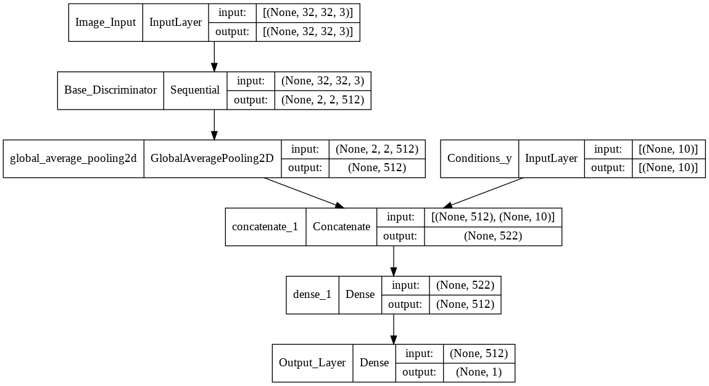
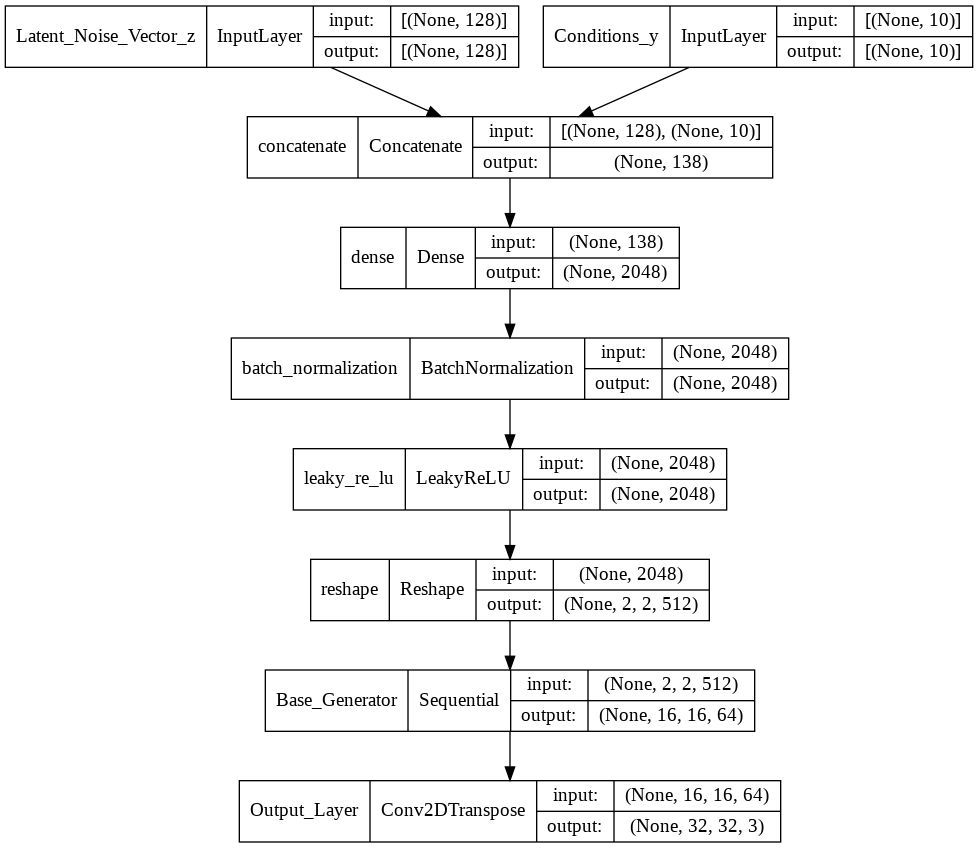
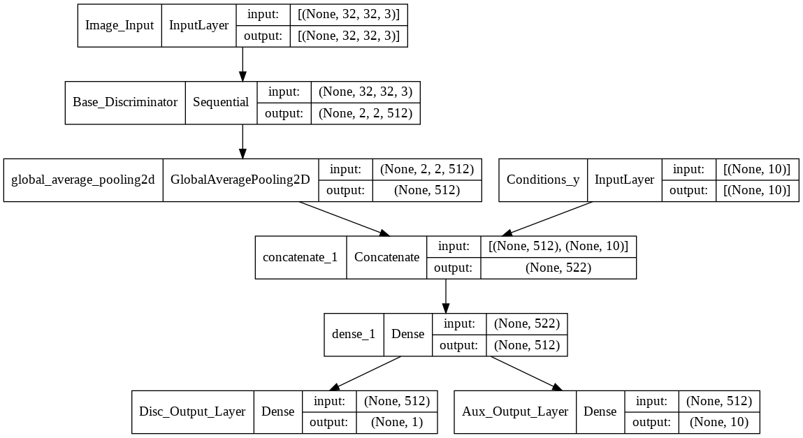

# Part A: CIFAR-10 Image Generation using GAN

- Author: Tan Yu Hoe / P2026409 / DAAA2B04
- Janurary 2022

## Evaluation Results

| Architecture | Epoch Checkpoint | FID | KL Divergence | ResNet34 Accuracy |
| --- | --- | --- | --- | --- |
| GAN | 40 | 138.33 +- 0.837 | 5.6873 | - |
| CGAN | 100 | 90.918 +- 0.325 | 4.6261 | 0.64 |
| ACGAN | 80 | 93.149 +- 0.737 | 4.4176 | 0.61 |

## Model Configuration

### Generative Adversarial Network

||
|:--:|
| 1000 small colour images created with CGAN |

### Conditional Generative Adversarial Network

|||
|:--:|:--:|
|CGAN Discriminator Architecture|CGAN Generator Architecture|

||
|:--:|
| 1000 small colour images created with CGAN |

### Auxiliary Classifier Generative Adversarial Network

|||
|:--:|:--:|
|ACGAN Discriminator Architecture|ACGAN Generator Architecture|

||
|:--:|
| 1000 small colour images created with ACGAN |
