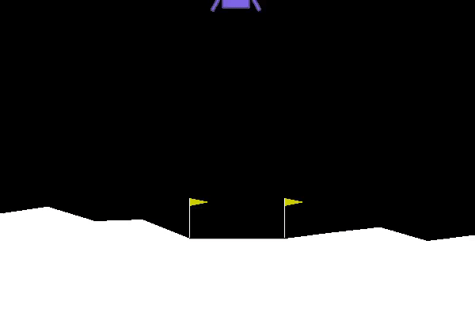

# DELE_CA2_RL

This repository is used to host all documents related to ST1504 Deep Learning CA2 Part B Reinforcement Learning.

## Authors

Class: DAAA 2B 04

| Name | Admin Number |
|------|--------------|
| Shi Tingxiao | P2033444 |
| Tan Yu Hoe | P2026309 |

## Reinforment Learning Models Implementation

- Deep Q-Network
- Dueling Deep Q-Network
- Double Dueling Deep Q-Network
- Actor-Critic Network

## Deep Q-Network

| Episodes | Score | Average Score (Rolling = 100) |
| --- | --- | --- |
| 500 | 246.06935108672096 | 214.31300487785856 |

|Train Learning Curve|Test Learning Curve|
| --- | --- |
|||

## Dueling Deep Q-Network

| Save | Episode | Score | Average Score |
| --- | --- | --- | --- |
| 110 | 616 | 310.19301981275464 | 257.78365299016065 |

|Train Learning Curve|Test Learning Curve|
| --- | --- |
|||

## Double Dueling Deep Q-Network

| Save | Episode | Score | Average Score |
| --- | --- | --- | --- |
| 133 | 446 | 303.21676824337214 | 267.273130316026 |

|Train Learning Curve|Test Learning Curve|
| --- | --- |
|||
